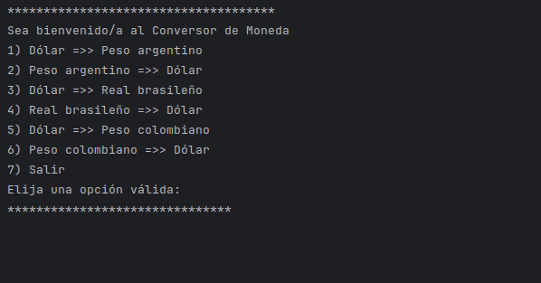
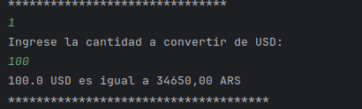
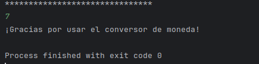

# Conversor de Moneda

Este proyecto es un conversor de monedas en Java que utiliza la API de tasas de cambio en tiempo real para convertir entre varias monedas.

## Funcionalidades

1. Convertir Dólar a Peso argentino
2. Convertir Peso argentino a Dólar
3. Convertir Dólar a Real brasileño
4. Convertir Real brasileño a Dólar
5. Convertir Dólar a Peso colombiano
6. Convertir Peso colombiano a Dólar

## Tecnologías utilizadas

- Java 17
- Gson (para procesar JSON)

## Instalación

1. Clona este repositorio.
2. Ejecuta `mvn clean install` para instalar las dependencias.
3. Corre la clase `ConversorMoneda.java`.

## Capturas

